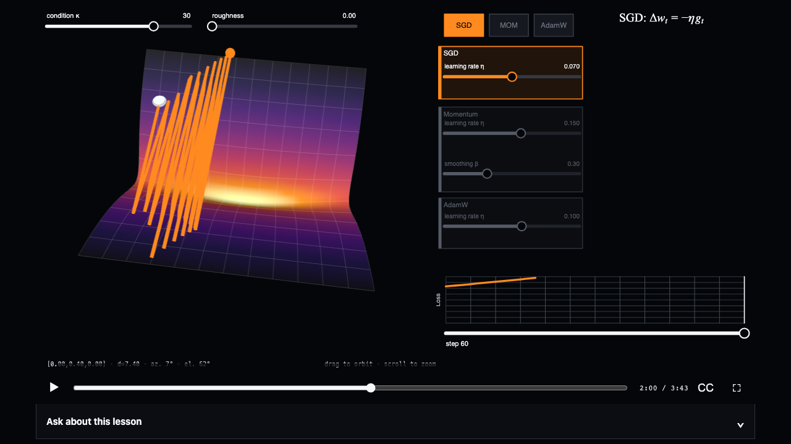

# Tangible

Tangible is an open-source toolkit for narrated interactive lessons. A lesson
combines a manipulable scene, spoken explanation, synchronized visual changes,
and an optional language model that can answer questions and temporarily
demonstrate ideas in the scene.



## Try the optimizer lesson

[Open “Why adaptive optimizers exist” on Hugging Face
Spaces](https://huggingface.co/spaces/dlouapre/tangible-optimizers).
[Browse the public Tangible lessons
collection](https://huggingface.co/collections/dlouapre/tangible-lessons-6a96e2c4be1533d68e65d7a2)
to find lessons published from this repository and by other creators.

The lesson lets you play or seek through the explanation, orbit the loss
landscape, move the starting point, change optimizer settings, pause for
exploration, and ask written questions.

## Create your first lesson

Tangible currently requires Node.js 22 or newer, Git, and pnpm. Node 22 includes
Corepack, which can activate the pnpm version pinned by the repository:

```bash
git clone https://github.com/scienceetonnante/tangible.git
cd tangible
corepack enable
pnpm install
pnpm build
```

Run an existing lesson without a credential, model download, or ffmpeg:

```bash
pnpm lesson preview --silent --lesson lessons/unit-circle
```

Generate a complete working lesson and open its interactive scene:

```bash
pnpm lesson new my-lesson --lesson lessons/my-lesson
pnpm lesson scene --lesson lessons/my-lesson
```

The generated lesson contains an accessible range control, a linked visual
result, short narration, a synchronized cue, and an interaction pause. Change
the scene and `script.md`, then validate and preview the complete lesson:

```bash
pnpm lesson check --lesson lessons/my-lesson
pnpm lesson preview --offline --lesson lessons/my-lesson
```

Audible offline preview requires ffmpeg and downloads a pinned 123 MB local
speech model on its first run. It needs no API key. The
[creator quick start](./docs/quickstart.md) walks through one visible scene
change, one narration edit, and one cue edit.

## Create a lesson with a coding agent

The repository includes instructions and a `create-tangible-lesson` skill for
coding agents. Copy this prompt and replace the bracketed text:

> Use `$create-tangible-lesson` and help me create a lesson about [subject]. The
> relationship I want learners to see is [relationship]. Build the smallest
> interactive scene first and stop for my review. Preserve my narration, turn
> my double-bracket hints into formal cues, and do not deploy until I explicitly
> authorize it.

The human owns the teaching argument, spoken narration, and final visual
judgment. The agent implements the scene, translates natural-language hints
after scene review, runs technical checks, and prepares builds. Production
narration and deployment begin only after the lesson is stable.

## How a lesson works

Tangible keeps authored state in readable text and TypeScript:

```text
script.md ─────────┐
                   ├─ compiler ─► narration + captions + animation tracks
scenes/scene.ts ───┘                              │
                                                 ▼
                              player: time ► state ◄ learner interaction
```

The scene schema gives the narration and the learner a shared vocabulary. The
human can write silent visual intent in double brackets:

```markdown
The horizontal projection is the cosine.
[[Reveal the projection as the narrator says “horizontal”.]]
```

An agent runs `lesson ref`, translates the hint into a schema-valid directive,
and checks it without contacting a provider:

```markdown
The @show(projection) horizontal projection is the cosine.
```

Every scene renders from the complete state at the current lesson time. Seeking
directly to a time therefore recreates the same view without replaying the
lesson from the beginning.

## Publish on Hugging Face Spaces

After reviewing the complete lesson with its production voice, prepare the local
Space metadata without contacting Hugging Face:

```bash
pnpm lesson deploy --prepare \
  --space namespace/space-name \
  --lesson lessons/my-lesson
```

Review and commit those files. Then authenticate, run the local release checks,
and create the Space privately:

```bash
hf auth login
pnpm lesson deploy --dry-run --create --lesson lessons/my-lesson
pnpm lesson deploy --create --lesson lessons/my-lesson
```

Deployment uploads only the release artifact, waits for the Space to start, and
prints logs when startup fails. It never makes an existing Space public, changes
hardware, or replaces secrets. Review the private Space before changing its
visibility. The [deployment guide](./docs/authoring.md#deploy-to-hugging-face-spaces)
explains production narration, assistant secrets, logs, and release checks.

Once your Space is public, you can ask the maintainers to add it to the
[Tangible lessons collection](https://huggingface.co/collections/dlouapre/tangible-lessons-6a96e2c4be1533d68e65d7a2)
by [opening a GitHub issue](https://github.com/scienceetonnante/tangible/issues/new)
with the Space URL. The collection accepts public lessons from any Hugging Face
account.

## Current scope and limitations

- Tangible currently assumes that narration is written in English.

- The first release supports desktop and tablet layouts. Portrait phones ask
  visitors to rotate the device or use a larger screen. Phone landscape uses a
  compact layout.

- Standard playback and assistant controls work with a keyboard, show visible
  focus indicators, and provide captions.

- Individual lessons can still contain canvas controls without equivalent HTML
  controls. The optimizer lesson describes its canvas for screen readers and
  distinguishes paths by labels, shapes, and line patterns, but its sliders,
  starting point, and camera are not fully keyboard-operable.

## Documentation

- [Creator quick start](./docs/quickstart.md) leads from a fresh clone to a
  modified lesson without paid credentials.

- [Authoring a lesson](./docs/authoring.md) covers scene design, narration,
  choreography, review, assistants, and deployment.

- [Reference](./docs/reference.md) documents every command, lesson file,
  manifest field, scene export, and narration directive.

- [Contributing](./CONTRIBUTING.md) explains how to work on lessons or the
  framework.

## Included lessons

- `unit-circle` is a compact two-dimensional lesson and the primary integration
  example.

- `optimizers` is a navigable three-dimensional optimizer comparison.

- `python-sampler` contains editable browser-based Python examples.

Authored lessons live in `lessons/`. Framework packages and the command-line
tool live in `packages/`. Generated `build/` and `.cache/` directories must not
be edited or committed.

## Contributing, security, and license

Read [CONTRIBUTING.md](./CONTRIBUTING.md) before submitting changes.

Tangible is licensed under the [Apache License 2.0](./LICENSE).
